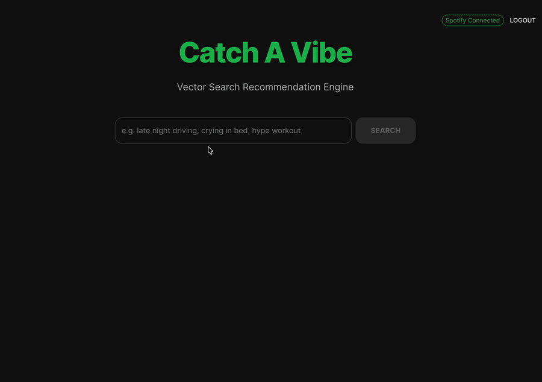
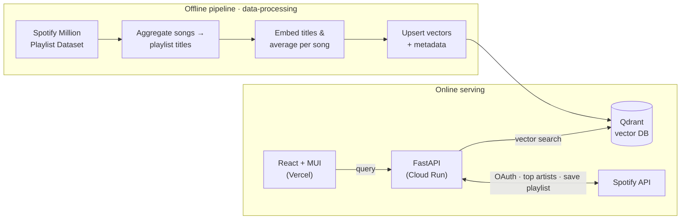

# Natural Language Playlist Recommender

**An NLP-powered playlist generator that turns a playlist title (e.g. "late night drive", "hype workout mix") into personalized Spotify recommendations via vector search.**

[](https://github.com/brendes6/Catch-A-Vibe/actions/workflows/ci.yml)


[](https://catch-a-vibe-six.vercel.app/)


**Live app:** https://catch-a-vibe-six.vercel.app/



---

## Overview and Motivation

The motivation behind this project is the fact that newly created Spotify playlists
rarely have good recommendations based on the title and user listening data. I considered
how this feature could be mapped as a (song title) -> (list of songs) problem, which led me to creating
this project. It maps free-text vibes to songs using semantic embeddings, as well as personalizing
the recommendations to your own music taste.

The core idea is a precomputed association between **playlist titles and the songs that
appear on them**. Every song is represented by the *average embedding of the playlist
titles it shows up on* across the subsampled Spotify Million Playlist Dataset (~600k songs). At query
time, your phrase is embedded into the same space and matched against those song vectors
through a multi-stage retrieval, scoring, and diversification pipeline.

## Architecture


```mermaid
flowchart LR
    subgraph Offline["Offline pipeline · data-processing"]
        MPD["Spotify Million<br/>Playlist Dataset"] --> AGG["Aggregate songs →<br/>playlist titles"]
        AGG --> EMB["Embed titles &<br/>average per song"]
        EMB --> UP["Upsert vectors<br/>+ metadata"]
    end
    UP --> QD[("Qdrant<br/>vector DB")]

    subgraph Online["Online serving"]
        UI["React + MUI<br/>(Vercel)"] -->|query| API["FastAPI<br/>(Cloud Run)"]
        API -->|vector search| QD
        API <-->|OAuth · top artists · save playlist| SP["Spotify API"]
    end
```

- Offline (`data-processing/process_data.py`): reads MPD slices, builds a
  `song → [playlist titles]` map, embeds every unique title once, averages titles per song
  into a normalized vector, and upserts vectors + payload (artist, track, album, popularity)
  into Qdrant with deterministic IDs (idempotent re-runs).
- Online (`backend/`): a FastAPI service that embeds the query, retrieves and re-ranks
  candidates from Qdrant, and integrates with the Spotify API for personalization and
  playlist saving.

## How recommendations work

1. Embedding foundation. Each song's vector is the mean of the
[`BAAI/bge-small-en-v1.5`](https://huggingface.co/BAAI/bge-small-en-v1.5) (384-d, via
FastEmbed/ONNX) embeddings of every playlist title it appears on, which encodes "what kind of
playlist does this song belong on."

2. Personalized taste profile. On Spotify login, the app pulls your top 50 artists and
computes an average "artist vector" for each from their songs in Qdrant.

3. Multi-stage retrieval.
- *Stage A*: pure query-embedding search over popular songs (`playlist_count ≥ 100`).
- *Stage B*: the same query search restricted to your top artists.

Candidates are merged and deduplicated.

**4. Composite scoring.** Each candidate is scored on:
- **50%** query-embedding similarity
- **15%** popularity (`log1p(playlist_count)`)
- **35%** artist affinity — a flat boost for your top artists, or a soft cosine-similarity
  boost for artists whose average vector is close to one of your top artists (e.g. if Drake
  is a top artist, 21 Savage songs get a partial boost).

(With no logged-in profile, scoring falls back to 75% query / 25% popularity.)

**5. MMR diversification.** Instead of taking the top-N, a **Maximal Marginal Relevance
(MMR)** pass (`λ = 0.7`) iteratively selects songs that balance score against similarity to
already-selected songs, with a hard cap of 3 songs per artist, pushing playlist generation towards a diverse set over
near-duplicates.

## Tech stack

| Layer | Technology |
| --- | --- |
| Frontend | React 19, Vite, Material UI (deployed on Vercel) |
| API | FastAPI, Uvicorn, Pydantic |
| Embeddings | FastEmbed — `BAAI/bge-small-en-v1.5` (384-d, ONNX) |
| Vector DB | Qdrant (Qdrant Cloud) |
| Auth / integration | Spotify OAuth 2.0 (spotipy) |
| Infra | Docker, Google Cloud Run |
| Data | Spotify Million Playlist Dataset, NumPy |

## Repository structure

```
Catch-A-Vibe/
├── backend/               # FastAPI recommendation + auth service
│   ├── main.py            # App, lifespan, endpoints, retrieval/scoring/MMR
│   ├── auth.py            # Spotify OAuth, sessions, taste profiles
│   ├── schemas.py         # Pydantic request/response models
│   ├── observability.py   # Prometheus observability logging
│   ├── redis_store.py     # Redis-based session store
│   ├── Dockerfile
│   └── requirements.txt
├── tests/                 # API/schema/observability tests
├── bench/                 # Locust load testing for recommendation API
│   └── locustfile.py      # Locust load testing implementation
├── data-processing/       # Offline pipeline: MPD → embeddings → Qdrant
│   ├── process_data.py
│   └── requirements.txt
└── frontend/              # React + MUI single-page app
    └── src/
```

## Running locally

**Prerequisites:** Python 3.11+, Node 18+, a Qdrant instance (Qdrant Cloud free tier or
local Docker), and a [Spotify developer app](https://developer.spotify.com/dashboard).

### Backend API

```bash
cd backend
python -m venv .venv && source .venv/bin/activate
pip install -r requirements.txt
cp .env.example .env          # fill in Spotify + Qdrant credentials
uvicorn main:app --reload --port 8080
```

Interactive API docs are then available at `http://localhost:8080/docs`.

### Data pipeline (one-time index build)

```bash
cd data-processing
pip install -r requirements.txt
cp .env.example .env
# download MPD slices into ./mpd-dataset/ (*.json), then:
python process_data.py
```

### Frontend

```bash
cd frontend
npm install
npm run dev
```

> The frontend points at the deployed Cloud Run API by default (`API_BASE` in
> `src/components/Call.jsx` and `SpotifyCallback.jsx`). Point it at
> `http://localhost:8080` to develop against a local backend.

## API reference

| Method | Path | Description |
| --- | --- | --- |
| `GET` | `/health` | Liveness/readiness probe |
| `GET` | `/api/auth/login` | Returns the Spotify authorization URL |
| `POST` | `/api/auth/callback` | Exchanges the OAuth code, builds a taste profile, returns a session |
| `POST` | `/recommend` | Ranked recommendations for a free-text vibe query |
| `POST` | `/api/save-playlist` | Saves the recommended tracks to the user's Spotify account |

## Deployment

- **Backend** — containerized (`backend/Dockerfile`) and deployed on **Google Cloud Run**.
  The FastEmbed model is baked into the image to avoid a cold-start download.
- **Frontend** — built with Vite and deployed on **Vercel**.
- **Qdrant** — hosted on **Qdrant Cloud**.
- **Config** — all credentials/URLs come from environment variables (see the `.env.example`
  files). Allowed CORS origins are controlled by `ALLOWED_ORIGINS`.

## Dataset & credits

Built on the [Spotify Million Playlist Dataset](https://www.aicrowd.com/challenges/spotify-million-playlist-dataset-challenge)
(AIcrowd), used for non-commercial/research purposes.
