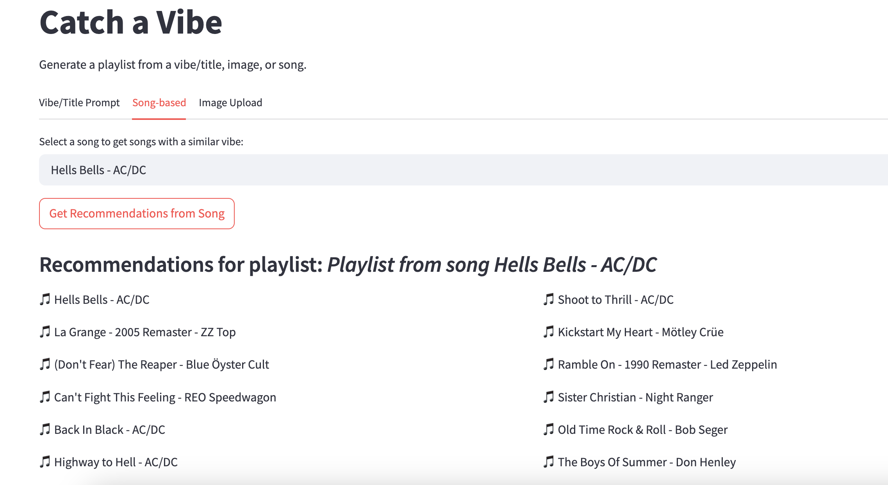

# Catch A Vibe – An NLP-Powered Playlist Generator

Ever had a playlist name pop into your head and think, *"I wish Spotify could just auto-fill this for me"*? That's what this app does.

You enter a vibe — like *"songs for dancing alone in your kitchen"* or *"gritty desert cowboy ride"*, and boom: full playlist. You can even upload a picture you want a playlist based on — sunset, anime lofi, workout poster — and the app matches it with music that fits the interpreted mood.

---

##  How It Works

The model uses [Sentence Transformers](https://www.sbert.net/) to embed both playlist titles and user input, then matches against a dataset of real Spotify tracks and a vector that embeds the 'vibe' of the playlists it appears on. The recs are based on *vibe similarity* — not just genre or popularity.

If you upload a picture, we use OpenAI's CLIP to turn that image into a text-like vibe embedding, then generate songs accordingly.

---

## Features

- Generate a playlist from any vibe title — even niche or emotional ones
- Upload a picture and get songs that *sound* like the image looks
- Fast, responsive UI built with Streamlit
- Works for multiple kinds of music: pop, indie, jazz, rap, rock, lofi, and more

---

##  Goals / Vision

My inspiration for this project came from constantly using the Spotify app and noticing that they have a ton of mixes made for different vibes - whether I type in "hype rap workout mix", "chill rock mix", or even "late night drive mix", a mix personalized for me always comes up. This gave me the idea to build a 'vibe'-based recommendation engine - sometimes you have the perfect vibe for a playlist in your head, but you can't quite think of songs that fit it. This app acts as both a solution to this problem and an attempted replication of Spotify's mix-creating feature.

---

## Previews

### Generating a playlist based on a vibe:

### Generating a playlist based on a song:

### Generating a playlist based on an image:

#### The image used:

---

## Try It Live

https://catch-a-vibe.streamlit.app/

---

## Tech Stack

- Python + Streamlit
- Pandas + numpy
- Spotify Web API 
- SentenceTransformers (MiniLM or similar)
- OpenAI CLIP (for image understanding)
